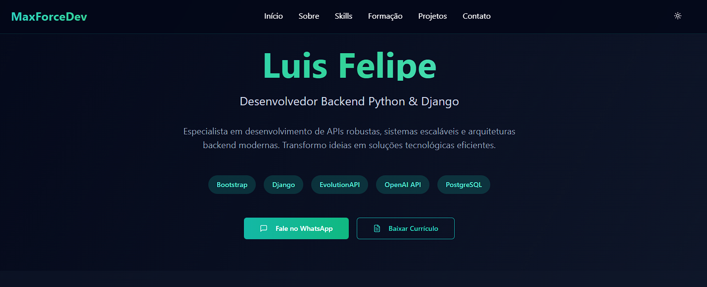
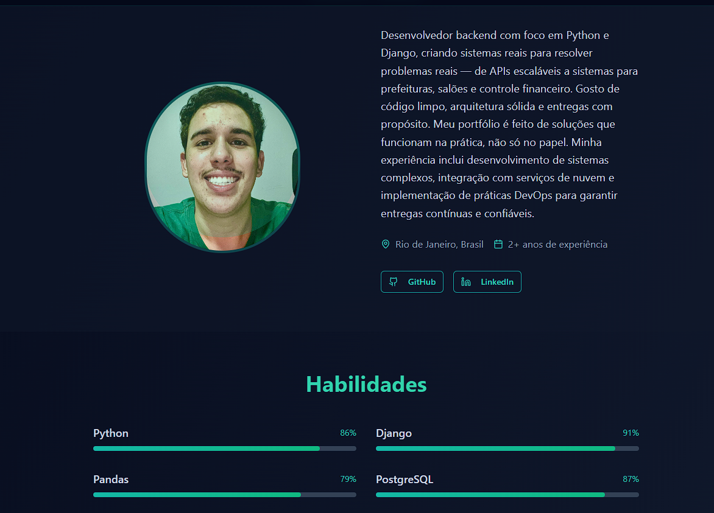
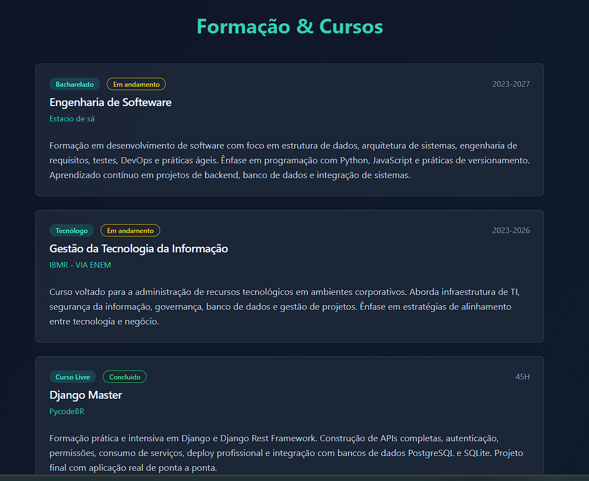

# 💼 Portfólio Profissional — Next.js + Django API

Este repositório contém **frontend** e **backend** completos para um portfólio pessoal. Criado com **Next.js (React)** e **Django REST Framework**, o sistema exibe dados públicos com administração via painel interno.

---


## 🖼️ Preview

Veja o site online 👉 **[maxforcedev.com.br](https://maxforcedev.com.br)**




---

## 🔧 Tecnologias

### Frontend
- Next.js 14 (App Router)
- TailwindCSS + Shadcn UI
- React-PDF
- TypeScript

### Backend
- Django 5.x
- Django REST Framework
- SQLite (modo local)
- Admin embutido

---

## 📁 Estrutura do Projeto

```
/meu-portfolio/
├── frontend/         # Projeto Next.js
├── backend/          # Projeto Django + DRF
└── README.md
```

---

## ▶️ Como rodar localmente

### 📦 1. Backend (Django)

```bash
cd backend
python -m venv venv
source venv/bin/activate  # ou venv\Scripts\activate no Windows
pip install -r requirements.txt
python manage.py migrate
python manage.py createsuperuser  # Crie login para acessar o admin
python manage.py runserver
```

> O backend estará disponível em: `http://localhost:8000`

---

### 🌐 2. Frontend (Next.js)

```bash
cd frontend
npm install  # ou pnpm install
```

Crie o arquivo `.env.local` na pasta `frontend/` com:

```
NEXT_PUBLIC_API_URL=http://localhost:8000
```

Depois inicie o projeto:

```bash
npm run dev  # ou pnpm dev
```

> O frontend estará disponível em: `http://localhost:3000`

---

## 🔐 Segurança

- A API só permite leitura pública (GET)
- O painel de admin (`/admin`) é protegido por login
- Imagens e dados são consumidos do backend via `fetch`

---

## ❌ O que não subir para o GitHub

- `.env`, `.env.local`
- `node_modules/`, `__pycache__/`
- `db.sqlite3`

Veja o `.gitignore` incluído no projeto.

---

## ✍️ Autor

Desenvolvido por **Luis Felipe Cavalini**  
📫 [LinkedIn](https://www.linkedin.com/in/maxforcedev)  
💻 [Portfólio pessoal](https://maxforcedev.com.br)

---
